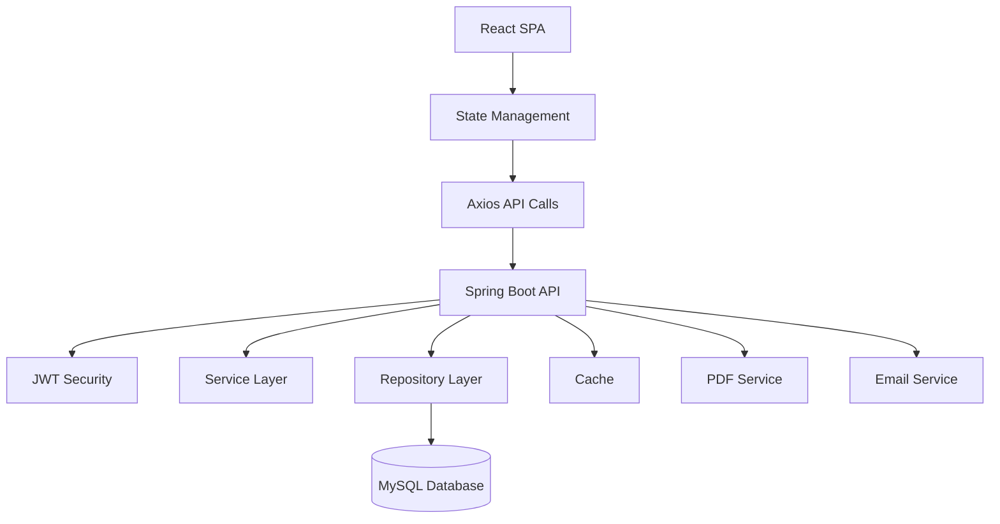
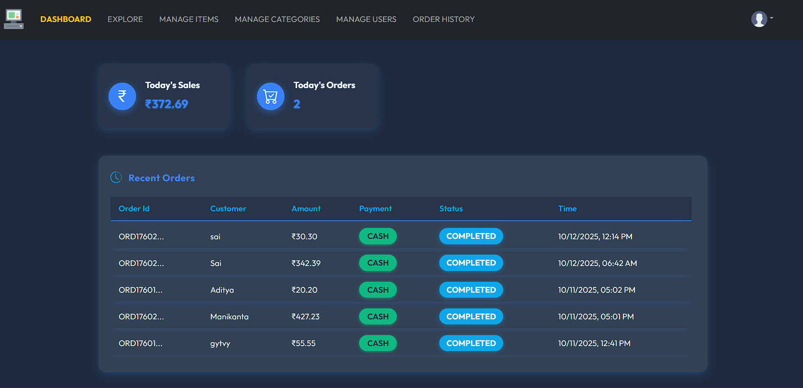
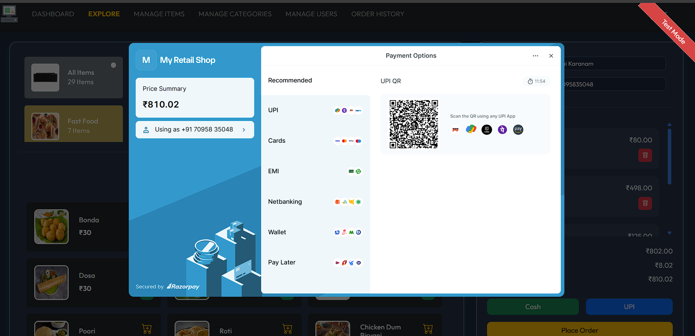
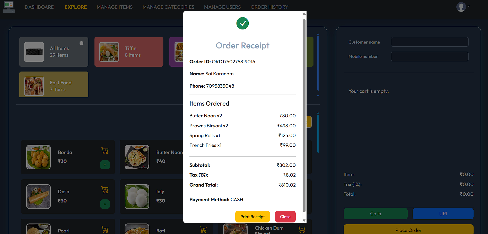
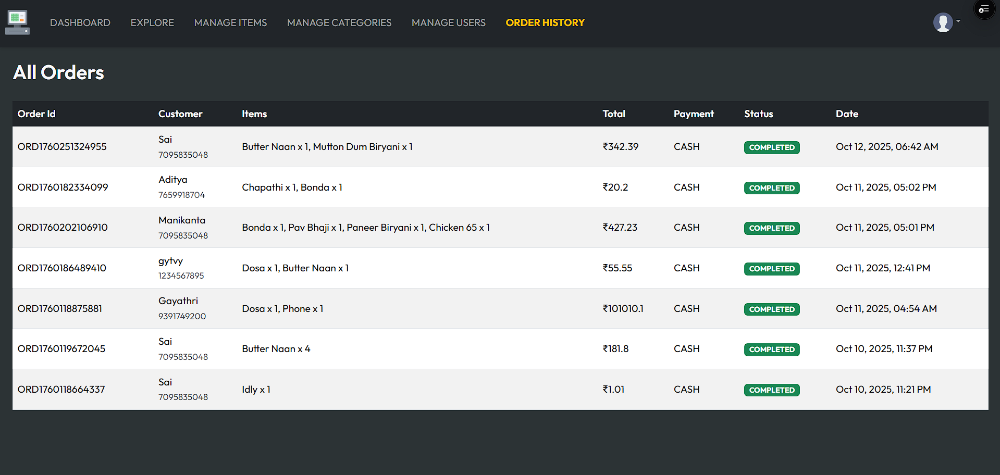

<h1 align="center">💼 Smart Billing Software</h1>

<p align="center">
  ⚡ Fast Billing | 🧾 Invoice Management | 📦 Inventory Tracking | 📊 Reports
</p>

<p align="center">
  
</p>

<p align="center">
  
  
  
  
</p>

<p align="center">
  
</p>

---

## 🌐 Live Demo

🔗 https://billing-software-omega.vercel.app  

---

## 📌 About The Project

💡 **Smart Billing Software** is a full-stack application designed to simplify billing and inventory management for businesses.

It allows users to manage products, generate bills, track sales, and maintain records efficiently.

> Built with scalable architecture using React + Spring Boot.

---

## 🏗️ System Architecture




## 🚀 Features

✨ Generate Bills & Invoices  
📦 Manage Products & Inventory  
📊 Sales Reports & Analytics  
🔐 Secure Authentication  
⚡ Fast & Responsive UI  
📁 Organized Data Management  
🧾 Auto Calculation of Total  
🌐 Full Stack Integration  

---

## 🎥 Demo Preview

<p align="center">
  
  
</p>

<p align="center">
  
  
</p>

<p align="center">
  
  
</p>

---

## 🛠️ Tech Stack

### 🎨 Frontend
- React (Vite)
- Bootstrap
- Axios

### ⚙️ Backend
- Spring Boot
- REST APIs

### 🗄️ Database
- MySQL

### 🔐 Security
- JWT Authentication

---

## 📂 Project Structure

### 🔹 Frontend
```
src/
 ├── components/
 ├── pages/
 ├── services/
 └── assets/
```

### 🔹 Backend
```
src/main/java/
 ├── .mvn/wrapper/
 ├── src/
 ├── uploads/
 
```

---

## ⚙️ Installation

### 1️⃣ Clone Frontend
```bash
git clone https://github.com/Saikaranam-70/billingSoftware.git
cd billing-software-frontend
npm install
npm run dev
```

### 2️⃣ Clone Backend
```bash
git clone https://github.com/Saikaranam-70/billing-software-backend.git
cd billing-software-backend
mvn clean install
mvn spring-boot:run
```

---

## 🔑 Environment Variables

Backend `.env` or `application.properties`:

```
spring.datasource.url=jdbc:mysql://localhost:3306/billing
spring.datasource.username=root
spring.datasource.password=your_password

jwt.secret=your_secret_key
```

---

## 📊 GitHub Stats

<p align="center">
  
  
</p>


---

## 🎯 Future Enhancements

📱 Mobile App Version  
📦 Barcode Scanner Integration  
📊 Advanced Analytics Dashboard  
🧾 PDF Invoice Generation  
☁️ Cloud Backup  

---

## 🤝 Contributing

Contributions are welcome! Feel free to fork this repo.

---

## 👨‍💻 Author

**Sai Karanam**  
🔗 https://github.com/Saikaranam-70  

---

## ⭐ Support

If you like this project, give it a ⭐

---

## 🐍 Contribution Snake

<p align="center">
  
</p>


